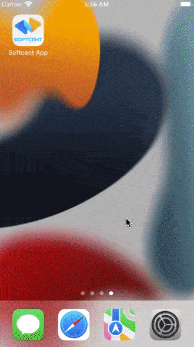

# Softcent App

&nbsp;&nbsp;
<a href="https://choosealicense.com/licenses/mit/" target="_blank"></a>&nbsp;&nbsp;


</img>

<p>Your task is to create the app same as the UI given in the figma. For the images, use the mock API given below.</p>

```
Mock API: https://mocki.io/v1/02e91d9f-4d8c-4eb4-a4f9-bb4a60ffdaf9
Figma:    https://www.figma.com/file/2azLj0d51KtMS9bEbdFmA6/Test-Task?node-id=0%3A1
```

Requirement:

1. Use Getx
2. App interface must be the same as the design except the images (Images will come from the api. Use “thumbnail” field from the api to show image)
3. Maintain clean code

You are free to extend any feature or add anything you want which can highlight your skill. Wish you good luck.

## Packages Used

<p align="justify">
  This application is using some third-party packages from the open-source community. Thanks to those open-source developers for their amazing packages. Those packages are: 
</p>

```
get: ^4.6.1                          // For state management & binding
flutter_staggered_grid_view: ^0.4.1  // For staggered grid view
persistent_bottom_nav_bar: ^4.0.2    // For bottom navigation bar
feather_icons: ^1.2.0                // For icons
http: ^0.13.4                        // For http request
```

## Softcent App Demo

<table align="center" style="margin: 0px auto;">
  <tr>
    <th>ExplorePage with popup</th>
    <th>Search Functionality</th>
  </tr>
  <tr>
    <td></img></td>
    <td></img></td>
  </tr>
  </table>

## File Pattern Inside The `'lib'` Folder

```
lib
├── app
│   ├── controllers
│   │   └── explore_page_controller.dart
│   ├── models
│   │   └── explore_page_model.dart
│   ├── pages
│   │   ├── add_page.dart
│   │   ├── explore_page.dart
│   │   ├── home_page.dart
│   │   ├── inbox_page.dart
│   │   └── shop_page.dart
│   ├── widgets
│   │   └── image_card.dart
│   └── bottom_nav_bar.dart
├── .DS_Store
└── main.dart
```
